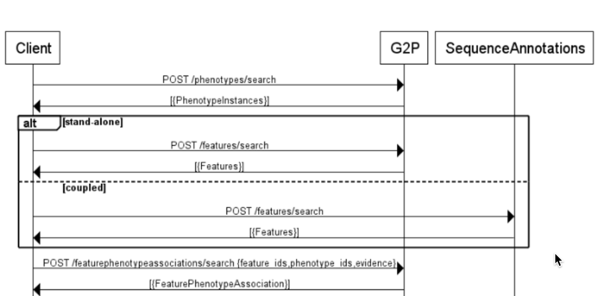
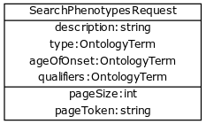
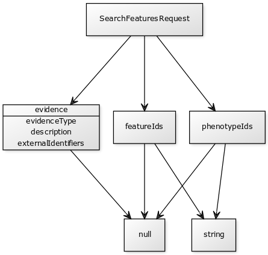

#Summary
-------

This API endpoints allows users to search for genotype-phenotype
associations in a GA4GH datastore. The user can search for associations
by building queries composed of features, phenotypes, and/or evidence
terms. The API is designed to accommodate search terms specified as
either a string, external identifier, ontology identifier, or as an
'entity' (See Data Model section). These terms are combined as an
``AND`` of ``(feature && phenotype && evidence)``. This flexibility in
the schema allows a variety of data to be stored in the database and
allows users to express a wide range of queries.

Users will receive an array of associations as a response. Associations
contain description and environment fields in addition to the relevant
feature, phenotype, and evidence fields for that instance of
association.

## Multiple server collation - Background


G2P servers planned to be implemented in three different contexts:

* As a wrapper around standalone local G2P "knowledge bases" (eg Monarch, CiVIC,etc).  Important considerations are the API needs to function independently of other parts of the API and separately from any specific omics dataset.  Often, these databases are not curated with complete Feature fields (referenceName,start,end,strand)


* Coupled with sequence annotation and GA4GH datasets.  Clients will want implementation specific featureId/genotypeId to match and integrate with the rest of the APIs.


* Operating in concert with other instances of g2p servers where the client's loosely federated query is supported by heterogeneous server.  Challenges:  Normalizing API behavior across implementations (featureId for given region different per implementation)


## Data Model

Intent: The GA4GH Ontology schema provides structures for unambiguous
references to ontological concepts and/or controlled vocabularies within
AVRO. The structures provided are not intended for de novo modeling of
ontologies, or representing complete ontologies within AVRO. References
to e.g. classes from external ontologies or controlled vocabularies
should be interpreted only in their original context i.e. the source
ontology.

Due to the flexibility of the data model, users have a number of options
for specifying each query term
[feature](https://github.com/ga4gh/schemas/blob/be171b00a5f164836dfd40ea5ae75ea56924d316/src/main/resources/avro/genotypephenotypemethods.avdl#L105),
[phenotype](https://github.com/ga4gh/schemas/blob/be171b00a5f164836dfd40ea5ae75ea56924d316/src/main/resources/avro/genotypephenotypemethods.avdl#L108),
and
[evidence](https://github.com/ga4gh/schemas/blob/be171b00a5f164836dfd40ea5ae75ea56924d316/src/main/resources/avro/genotypephenotypemethods.avdl#L111).


##API

The G2P schemas define a several endpoints broken into two entity searches and an association search.   

A feature or phenotype can potentially be represented in increasing
specificity as either [a string, an ontology identifier, an external
identifier, or as a feature 'entity'].  One criticism of the previous API is that it is overloaded, it violates a design goal of separation of concerns.  Specifically it combines the search for evidence with search for features & search for genotypes.

The refactored API move search,alias matching and external identifiers lookup to dedicated end points. To separate concens, a client performs the queries for evidence in two steps: first find the desired entities and then you those enitity identifiers to narrow the search for evidence.

Additionally the API supports two implementation styles: integrated and standalone.




###Entity Searches

* ``/datasets/<datasetId>/features/search``
	* 	Given a SearchFeaturesRequest, return matching _features_ in the `current 'omics dataset`. Intended for sequence annotation and GA4GH datasets.
* ``/genotypes/search``
	* 	Given a SearchGenotypesRequest, return matching _genotypes_ in the in the `current g2p dataset.`.  Intended for standalone local G2P "knowledge bases"
* ``/phenotypes/search``
	* 	Given a SearchPhenotypesRequest, return matching _phenotypes_ in the in the `current g2p dataset.`


###Association Search

* ``/associations/<phenotypeAssociationSetId>/genotypephenotypes/search``
	* 	Given a SearchGenotypePhenotypeRequest, return matching _evidence associations_ in the `current g2p dataset.`


Usage
---

1. As a GA4GH client, use entity queries the for the genotypes and phenotypes you are interested in.
2. Create an association search using the entity identifiers from step 1.
3. Repeat 1-2 as necessary, collating responses on the client.

Many types rely heavily on the concept of an [OntologyTerm](https://github.com/ga4gh/schemas/blob/be171b00a5f164836dfd40ea5ae75ea56924d316/src/main/resources/avro/ontologies.avdl#L10)  (see end of document for discussion on usage of OntologyTerms).


##Implementation


### Source Code
* [Front End](https://github.com/ohsu-computational-biology/server/blob/g2p-2.0/ga4gh/frontend.py) '/genotypes/search', '/phenotypes/search', '/genotypephenotypes/search'
* [Back End](https://github.com/ohsu-computational-biology/server/blob/g2p-2.0/ga4gh/backend.py) 'runSearchGenotypePhenotypes', 'runSearchPhenotypes', 'runSearchGenotypes' 
* [Datamodel](https://github.com/ohsu-computational-biology/server/blob/g2p-2.0/ga4gh/datamodel/genotype_phenotype.py) 'getAssociations'

### Tests 
* [End to End](https://github.com/ohsu-computational-biology/server/blob/g2p-2.0/tests/end_to_end/test_g2p.py) 

   **Help Wanted:** Any or all use cases and scenarios


### Acceptance
* Submittal of 3 simultaneous pull-requests for server, schema and compliance repositories
* 2 +1 for each repository from outside the development team
* Additional 3 day review for schemas


##API Details and Examples

###``/phenotypes/search``




Terms within a query are combined via AND
e.g

```
request = "phenotype": { description:"AML",  "ageOfOnset": {"id": "http://purl.obolibrary.org/obo/HP_0003581"}}

is transformed by the server to:

query = (description="AML" and ageOfOnset="http://purl.obolibrary.org/obo/HP_0003581")
```

Items in the qualifiers array are OR'd together. For example, severe or abnormal:

```
request = ... "phenotype": { description:"AML",  "qualifiers": [{"id": "http://purl.obolibrary.org/obo/PATO_0000396"},{"id":"http://purl.obolibrary.org/obo/PATO_0000460"}] } ....

is transformed by the server to:

query = (description="AML" and (qualifier = "http://purl.obolibrary.org/obo/PATO_0000460" or qualifier = "http://purl.obolibrary.org/obo/PATO_0000460"))
```

The service returns a list of matching PhenotypeInstances.


#### Examples:Phenotype Lookup

Q: I have a Disease ontology id ("http://www.ebi.ac.uk/efo/EFO_0003767").

Use an OntologyTerm.
```
request = { ...  "type": {"id": "http://www.ebi.ac.uk/efo/EFO_0003767"}  .... }
```
The system will respond with phenotypes that match on OntologyTerm.id


Q: I have a phenotype id (“p12345”)
Create an PhenotypeQuery using id field.
```
request = ...  {  "id": "p12345"  } ....
```
The system will respond with phenotypes that match on PhenotypeInstance.id


Q: I have an ontology term for a phenotype (HP:0001507, 'Growth abnormality' )

Use an OntologyTerm.
```
request = ...  {  "type": {"id": "http://purl.obolibrary.org/obo/HP_0001507"}  } ....
```
The system will respond with phenotypes that match on OntologyTerm.id


Q: I am only interested in phenotypes qualified with (PATO_0001899, `decreased circumference`  )
Create a PhenotypeQuery
```
request = ...  {  "qualifiers": [{"id": "http://purl.obolibrary.org/obo/PATO_0001899"}] } ....
```
The system will respond with phenotypes whose qualifiers that match that ontology 'is\_a'


Q: I have a disease name "inflammatory bowel disease"

Create an PhenotypeQuery using description field.
``{"description": "inflammatory bowel disease",...}``
The system responds with Phenotypes that match on OntologyTerm.description
Note that you can wildcard description.
``{"description": "*bowel*",...}``


___

###``/genotypes/search``

This endpoint is provided to serve features/variants/etc hosted by a g2p dataset when it is deployed independently of the sequenceAnnotations API.  The request and response payloads are similar to `features/search`.


Terms within a query are combined via AND
e.g

```
request = { "name":"KIT",  "referenceName": "hg38" }

becomes

query = (name="KIT" and referenceName ="hg38")
```


The service returns a list of matching Features.

####Examples:Genotype Lookup


Q: I have a SNPid ("rs6920220"). Create an External Identifier Query.

``{… {"ids": [{"identifier": "rs6920220", "version": "*", "database": "dbSNP"}]},  … }``

The   endpoint will respond with features that match on external identifier.
Multiple identifiers are OR'd together.


Q: I have an identifier for BRCA1  `GO:0070531` how do I query for feature?
Create an OntologyTerm query
``{…   {"type": {"id":"http://purl.obolibrary.org/obo/GO_0070531"},  … }``

The endpoint  will respond with features that match on that term

Q: I only want somatic variant features `SO:0001777` how do I limit results?
Specify featureType
``{… {"featureType":"http://purl.obolibrary.org/obo/SO_0001777",  … }``
The  endpoint  will respond with features that match on that type


___

###``/features/search``


**See sequence annotations [documentation](https://github.com/ga4gh/schemas/blob/master/doc/source/api/sequence_annotations.rst)**

___

###``/genotypephenotypes/search``

The endpoint accepts a SearchGenotypePhenotypeRequest POST.
The request may contain a feature, phenotype, and/or evidence, which are combined as a logical AND to query the underlying datastore. Missing types are treated as a wildcard, returning all data.  The genotype and phenotype fields are either null or a list of identifiers returned from the entity queries.  The evidence query object allows filtering by evidence type.



The SearchGenotypePhenotype search is simplified.  Features and Phenotypes are expressed as a simple array of strings.
Evidence can be queried via the new EvidenceQuery.


The response is returned as a list of associations.


####*Implementation Guidance: Results*

Q: I need a place to store publication identifiers or model machine learning and statistical data.

The "info" key value pair addition to Evidence

```
    {
      "evidenceType": {
        "sourceName": "IAO",
        "id": "http://purl.obolibrary.org/obo/IAO_0000311",
        "sourceVersion": null,
        "term": "publication"
      },
      "info": {"source": ["PMID:21470995"]},
      "description": "Associated publication"
    }
    {
      "evidenceType": {
        "sourceName": "OBI",
        "id": "http://purl.obolibrary.org/obo/OBI_0000175",
        "sourceVersion": null,
        "term": "p-value"
      },
      "info": {"p-value": ["1.00e-21"]}
      "description": "Associated p-value"
    },
    {
      "evidenceType": {
        "sourceName": "OBCS",
        "id": "http://purl.obolibrary.org/obo/OBCS_0000054",
        "sourceVersion": null,
        "term": "odds ratio"
      },
      "description": "1.102"
    }
```


Use cases
---------

1) As a clinician or a genomics researcher, I may have a patient with
   Gastrointestinal stromal tumor, GIST, and a proposed drug for
   treatment, imatinib. In order to identify whether the patient would
   respond well to treatment with the drug, I need a list of features
   (e.g. genes) which are associated with the sensitivity of GIST to
   imatinib. Suppose I am specifically interested in a gene, *KIT*,
   which is implicated in the pathogenesis of several cancer types. I
   could submit a query to ``/genotypephenotype/search`` with GIST as
   the phenotype, *KIT* as the feature, and
   `clinical study evidence <http://purl.obolibrary.org/obo/ECO_0000180>`__
   as the evidence.

In response, I will receive back a list of associations involving GIST
and *KIT*, which I can filter for instances where imatinib is mentioned.
URI's in the ``associations`` field could - hypothetically - be followed
to discover that `GIST patients with wild-type *KIT* have decreased
sensitivity to therapy with
imatinib <http://www.ncbi.nlm.nih.gov/pmc/articles/PMC2651076/>`__.

If I left both the ``genotype`` and ``evidence`` fields as ``null``, I
would receive back all associations which involve GIST as a phenotype.

2) As a non-Hodgkin's lymphoma researcher, I may know that the gene
   *CD20* has abnormal expression in
   `Hodgkin's lymphoma <http://purl.obolibrary.org/obo/DOID_8567>`__.
   I might be interested in knowing whether *CD20* also has abnormal
   expression in
   `non-Hodgkin lymphoma <http://purl.obolibrary.org/obo/DOID_0060060>`__.
   Therefore I could perform a query with *CD20* as a feature,
   non-Hodgkin's lymphoma as a phenotype, and
   `RNA sequencing <http://purl.obolibrary.org/obo/OBI_0001177>`__
   as the evidence type.

3) As a genetic counselor, I may be wondering if a mutation in one of my
   clients' genes has ever been associated with a disease. I could then
   do a query based on the gene name as the feature and
   `disease <http://purl.obolibrary.org/obo/DOID_4>`__ as the
   phenotype.

For specifics of the json representations, please see the
`server <https://github.com/ga4gh/server>`__ and
`compliance <https://github.com/ga4gh/compliance>`__ repositories.

Ontologies
----------

**Usage:** Multiple ontology terms can be supplied e.g. to describe a series
of phenotypes for a specific sample. The ontology.avdl is not intended
to model relationships between terms, or to provide mappings between
ontologies for the same concept. Should an OntologyTerm be unavailable,
or terms unmapped then an 'annotation' can be provided which can later
be mapped to an ontology term using a service designed for this. Using
OntologyTerm is preferred to using Annotation. Though annotations can be
supplied with related ontology terms if desired. A use case could be
when a free text annotation is very specific and a more general
OntologyTerm is supplied.


**Definitions:**

*Annotation* - A free text annotation which is not an
ontology term describing some attribute. Annotations have associations
with OntologyTerms to allow these to be added after annotations are
captured. OntologyTerms are preferred over Annotations in all cases.
Annotations can be used in conjucntion with OntologyTerms

*OntologyTerm* - the preferred term for the class in question. For example
http://purl.obolibrary.org/obo/HP\_0011927 preferred term is 'short
digit' and synonym is 'VERY SHORT DIGIT'. 'short digit' is the term that
should be used.


*OntologyTerm identifier* - An identifier for a single ontology term from
a single ontology source specified as a CURIE (preferred) or PURL

*OntologySource* - the name of ontology from which the term is obtained.
e.g. 'Human Phenotype Ontology'

*OntologySource identifier* - the identifier -a CURIE (preferred) or PURL
for an ontology source e.g. http://purl.obolibrary.org/obo/hp.obo

*OntologySource version* - the version of the ontology from which the
OntologyTerm is obtained. E.g. 2.6.1. There is no standard for ontology
versioning and some frequently released ontologies may use a datestamp,
or build number.


---
# Directions for future capabilities.

**Flexible representation of Feature**


* Q: I only have description to represent a Genomic Feature ("KIT N822K"). (Not all G2P databases have complete genomic location information or are associated with GA4GH omics dataset.)
* Q: I need to lookup Feature by protein/externalId/name/description.
* Q: I have results from multiple G2P Servers.  How do I collate them?
  * Use HGVS' DNA annotation for featureId. This should be unique for identical features across datasets and implementations?


**Expanding scope to entities other than Feature**

Consider instead a PhenotypeAssociation which has a wider scope; the objects it
connects and the evidence type determines the meaning of the association


### Convenience endpoints

(As needed)

```
GET /associationsets/<phenotypeAssociationSetId>/feature/<id>/associations
GET /associationsets/<phenotypeAssociationSetId>/feature/<id>/genotypes
GET /associationsets/<phenotypeAssociationSetId>/feature/<id>/phenotypes

GET /associationsets/<phenotypeAssociationSetId>/genotype/<id>/associations
GET /associationsets/<phenotypeAssociationSetId>/genotype/<id>/features
GET /associationsets/<phenotypeAssociationSetId>/genotype/<id>/phenotypes

GET /associationsets/<phenotypeAssociationSetId>/phenotypes/<id>/associations
GET /associationsets/<phenotypeAssociationSetId>/phenotypes/<id>/features
GET /associationsets/<phenotypeAssociationSetId>/phenotypes/<id>/genotypes
```
